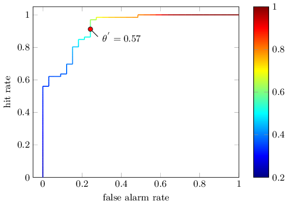
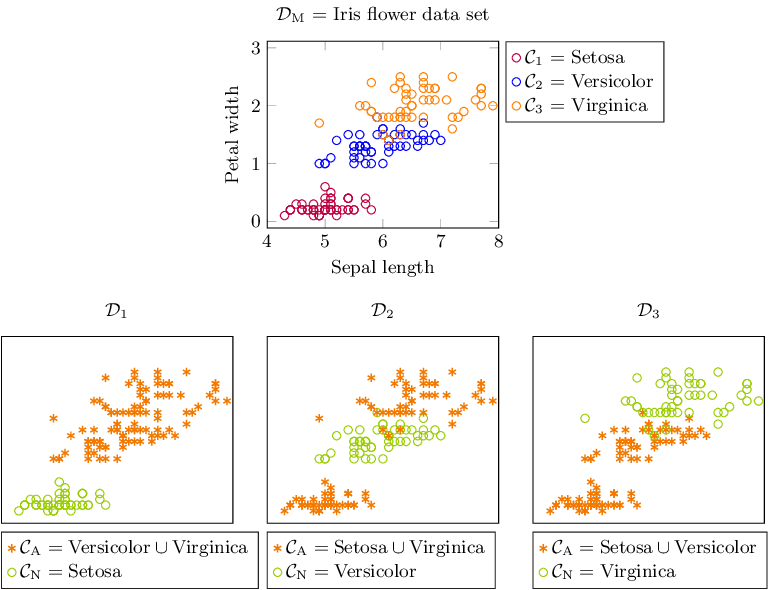
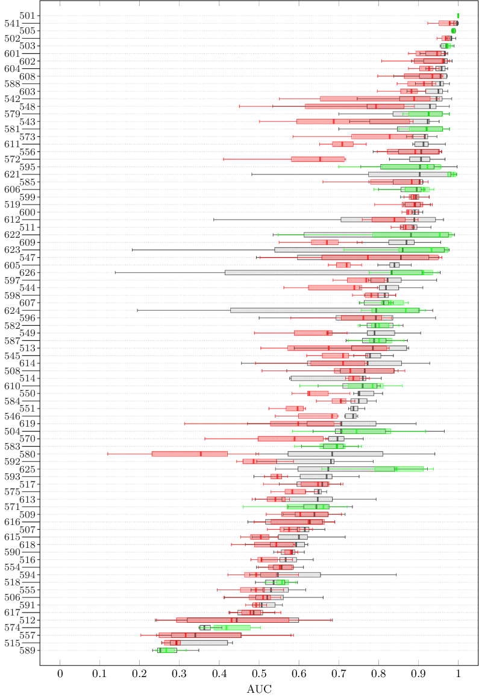
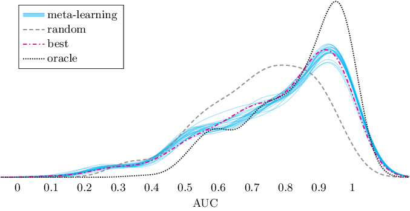
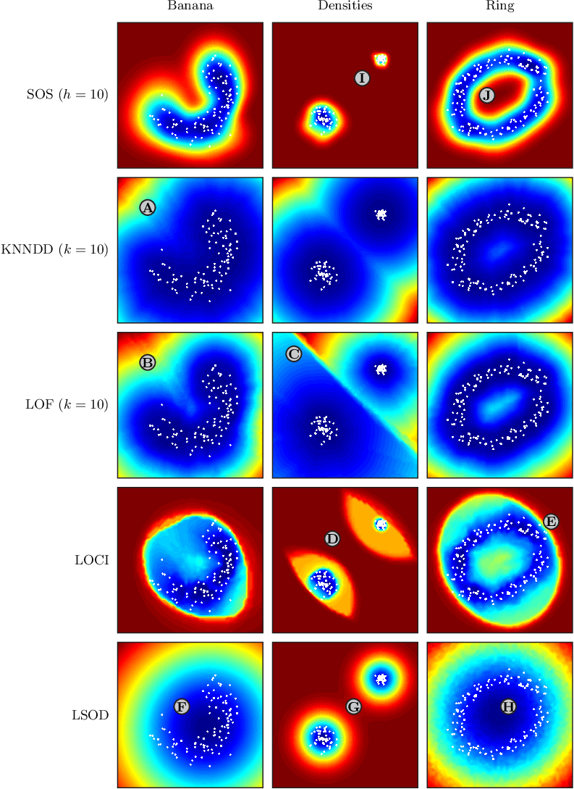
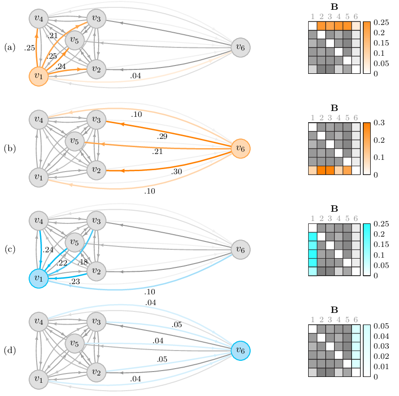
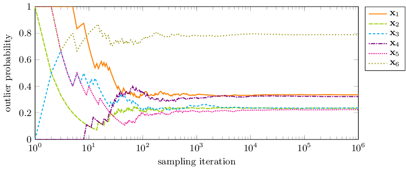
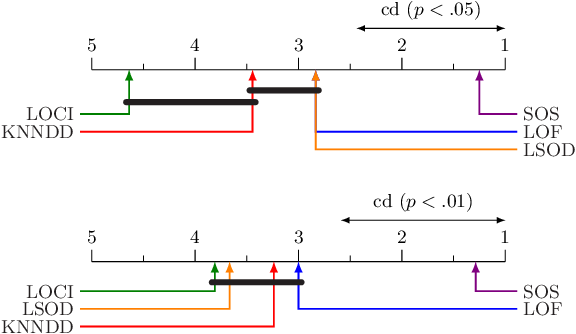

Outlier Selection and One-Class Classification
==============================================

Currently, only the PDF of my thesis is available for download. In the future I may add the LaTeX, figures, and data as well.


Figures
-------

The figures in the thesis are created using Python, MATLAB and TikZ. The TikZ code of the figures can be found in `/figures/tikz`. To compile all the figures to PDF, I wrote a script called [tikz2pdf](https://github.com/jeroenjanssens/tikz2pdf).

```bash
$ tikz2pdf figures/tikz/*.tikz --template figures/thesis-template.tex --output figures/pdf/
```

Below are some figures from the thesis. Please note that these are rendered with a different font. Also, the conversion from PDF to PNG with ImageMagick isn't all that great.

### figures/tikz/bg-banana-roc.tikz


### figures/tikz/bg-multiclass.tikz


### figures/tikz/eval-boxplot-preprocessing-pca.tikz


### figures/tikz/mlc-mapping-auc-overview.tikz


### figures/tikz/sos-densities.tikz


### figures/tikz/sos-graph-matlab-binding.tikz


### figures/tikz/sos-graphs-sample.tikz


### figures/tikz/sos-nemenyi.tikz

